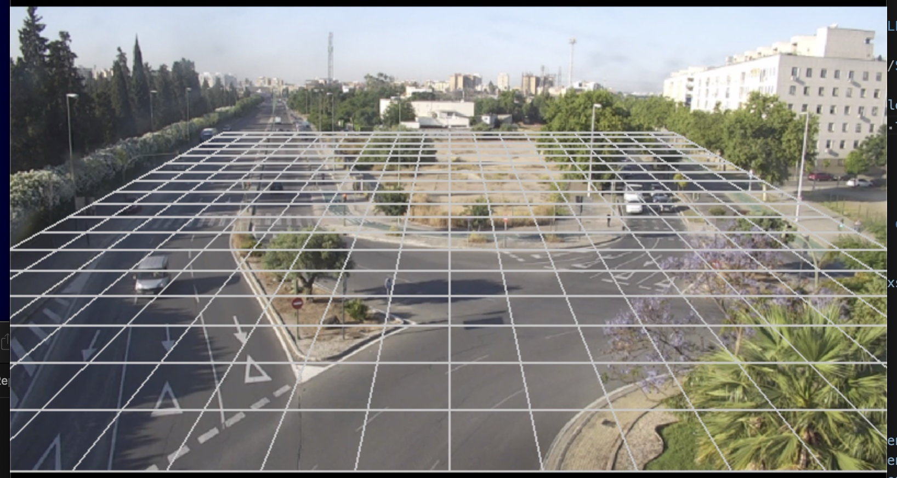

# PySimTravel4

PySimTravel4 es un simulador realizado entre la Universidad de Sevilla (Departamento de Arquitectura y Tecnología de Computadores) y el Ayuntamiento de Sevilla (Área de Movilidad de Tráfico)

El objetivo es realizar una simulación mesoscópica con el objetivo de servir para la optimización semafórica y la ubicación óptima de puntos de recargas de vehículos eléctricos.

|  |  |
|---|---|
|||

Se compone de 7 módulos:

- map
- [server](./server/)
- route
- count
- light
- electric
- simulator

# Map 
Este módulo prepara la información de Open Street Map (OSM) para realizar la navegación requerida por el simulador de manera automática.
La información proveniente 
Aunque persenta algunos errores que deben de ser pulidos. El callejero conforma un grafo, el cual tiene errores que serán filtrados. No se trabaja con toda la versión, para ello se usarán dos versiones, una con el viario principal y otra que llega a los 500 cruces con regulación semafórica. Se le presta asistencia al simulador y a la implementación semafórica. 

# Server
Tiene una arquitectura cliente-servidor. El servidor está desarrollado en python, aunque usa alguna tecnología de node.js como open layers. 
Permite la visualización de callejero, así como la edición de cruces. 
Ya que la simulación es atemporal, a partir del log de vehículos se puede hacer una reconstrucción. 

# Route
Hay dos tipos de rutados, uno de fondo o probabilístico que siguen la mayoría de vehículo. Otro que va desde un origen a destino que siguen los vehículos a estudiar. En concreto los vehículos eléctricos. Se parte de trabajos previos en los que se calculó de forma óptima Dijsktra para un gran grafo y número de vehículos. Hacer un rutado "egoista" no es lo mejor. Se requiere repetir el proceso varias veces para conseguir un throuput óptimo. 
Este módulo está desarrollado para GPU para un alto rendimiento.
Se contempla el problema de la asignación de tráfico. Pudiendo complementar el uso de matrices de origen destino.

# Count
Uno de los mayores problemas son los datos. Para mitigar la falta de datos contamos con detectores ubicados estratégicamente. Obviamente el número de vehículos que entran y salen de un cruce son siempre los mismos. Si entendemos que los coches cuando llegan a una bifurcación tiran un dado de la bifurcación al final podemos quedarnos con una solución coherente. Hay que estimar las probabilidades en cada bifurcación. Como no hay detectores en todos los tramos, algunos tramos tenemos que estimarlos. Sería ideal que el modelo adaptara el número de vehículos por horas. Incluimos un concepto de aforamiento de la capacidad máxima basadas en los primeros ciclos semafóricos. Idealmente, al final es interesante simular un patrón de crecimiento del número de vehículos para ver la capacidad de transporte de la ciudad. 

# Light
Una ciudad sin semáforos colapsa. La información del ciclo semafórico no está informatizada. Si digitalizada. Se reliza por tanto un intento de informatizarla. Intentaremos que sea un proceso automático, pero tenemos presente una edicción total o parcial. Idealmente se puede optimizar los semáforos. Una cuestión es adaptar el reparto según el afortamiento y otra es que los tramos principales se sincronicen para producir ondas verdes. Existen momentos en los que se supera la capacidad y el sistema colapsa. En dichos momentos es importante hacer que el tráfico espere en el lugar apropiado, para que el cruce, o la ciudad no colapse.
Se contemplan estimaciones de tráfico a partir de detectores o incluso llevando la ciudad a su capacidad máxima, así como patrones de crecimiento.

# Electric
El vehículo eléctrico para nuestro simulador contará con plazas en los parking principales. Nuestro vehículo elétrico trata de llegar a unos puntos destinos y cuando termina vuelve a empezar. Se desea hallar la distribución ideal de cargadores en dichos parking. 

# Simulator
Hay tres simulaciones, python, C++ y Cuda/Numba. El simulador actual es uno mesoscópico, que se ejecuta en los tramos críticos, compartidos o regulados por semáforos. Es atemporal, esto es no se puede visualizar al ejecutarse. Pero si se puede guardar un log de los vehículos para luego visualizarlo. Es apto para rutado probabilítico, y usa un truco cuando hay mas de un carril (2 lanes=medida coche/2). Idealmente es interesante migraciones a CUDA y C++.
Se contempla realizar simulaciones en HPC.

